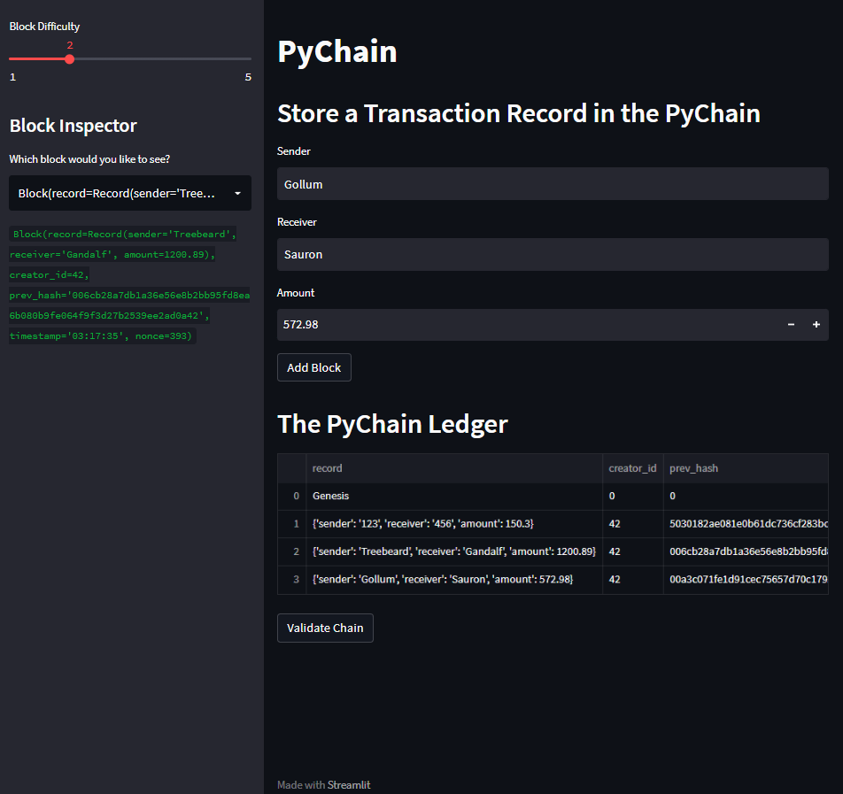
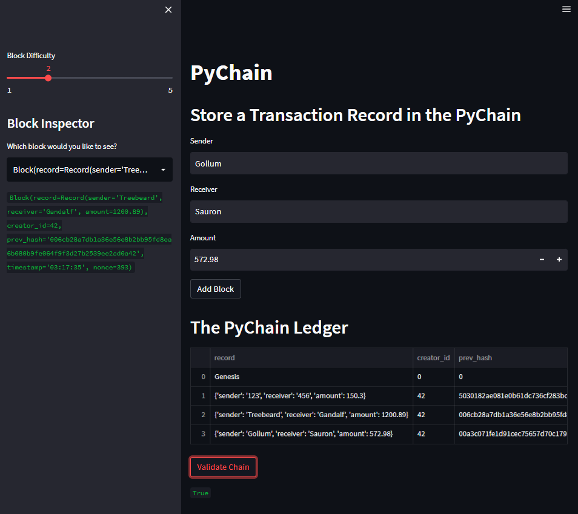

# Blockchain Ledger
Blockchain-based ledger system that allows users to conduct financial transactions and to verify the integrity of the data in the ledger

---

## Summary

The Pychain ledger contains the following:

* A data class named Record. This class will serve as the blueprint for the financial transaction records that the blocks of the ledger will store.
* User input areas in the `Streamlit` application. These input areas collect the relevant information for each financial record that you’ll store in the PyChain ledger.
* `Streamlit` is an open-source Python library that makes it easy to create web apps 
---
## Installation and Usage

```sh
git clone https://github.com/diegoalcocer/blockchain-ledger.git
cd blockchain-ledger/
```
To run the `Streamlit` application:

```sh
streamlit run pychain.py
```
Make sure you have [streamlit installed](https://docs.streamlit.io/library/get-started/installation). You can use the following command:
```sh
pip install streamlit
```

### 📚 img/

With the pychain ledger you can create multiple blocks and add them to the chain and visualize them.

You can verify the block contents and hashes in the Streamlit drop-down menu. Also you can visualize a blockchain that consists of multiple blocks.


---

If you want to test the blockchain validation process you can click on the button `Validate Chain` which should indicate the validity of the blockchain.



## License

[](https://www.gnu.org/licenses/gpl-3.0)
